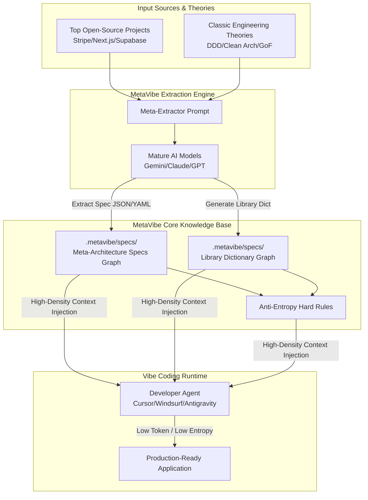

# ARCHITECTURE.md - MetaVibe Architecture Design & Extractor Specs

Language: **[English](ARCHITECTURE.md)** | **[中文](ARCHITECTURE_zh.md)**

This document defines MetaVibe's core architectural philosophy, Meta-Architecture Extraction Engine, Meta-Factory standards, and Engineering Library Specification Dictionary format.

---

## 1. System Architecture Overview



---

## 2. Meta-Architecture Extraction Engine

### 2.1 Extraction Philosophy: Pattern Abstraction without Code Copying
Extraction is **not about copying code**, but capturing the "golden skeleton" and "design principles" behind top systems:
- **Boundary Layers**: Isolation rules (e.g., Presentation -> Domain -> Infrastructure).
- **Data Flow Patterns**: Unidirectional Data Flow, Event-Driven Commands, etc.
- **Interface Slots**: Preserved extension slots for core features while stripping concrete business logic.
- **Anti-Entropy Guardrails**: Extracted Lint/Rule mechanisms preventing code rot (e.g., forbidding circular imports, enforcing DTO conversions).

---

## 3. Meta-Architecture Spec Schema

A standard Meta-Architecture Spec covers four key dimensions:

```json
{
  "name": "CleanArchitectureWeb",
  "version": "1.0.0",
  "description": "Clean Architecture Spec for Web APIs",
  "layers": [
    {
      "name": "Domain",
      "rules": ["Forbidden from depending on external frameworks/DBs", "Contains pure entities & domain rules"]
    },
    {
      "name": "Application",
      "rules": ["Depends only on interface abstractions via Dependency Injection"]
    }
  ],
  "slots": [
    {
      "name": "AuthAdapter",
      "type": "Interface",
      "description": "User authentication slot"
    }
  ],
  "guardrails": {
    "max_file_lines": 300,
    "forbidden_imports": [
      { "from": "Presentation", "import": "Database" }
    ]
  }
}
```

---

## 4. Anti-Entropy Guardrails

Guardrails protect Vibe Coding projects from late-stage code collapse:
- **Structure Lock**: Prevents or corrects AI when it attempts to create files in unapproved layers.
- **Token Saver Injection**: Hides implementation details of completed components from AI, exposing only Spec interfaces to minimize Context window footprint.

---

## 5. Engineering Library Dictionary Spec

The **Library Specification Dictionary** is a unified contract enabling AI Agents to instantly understand third-party libraries, standard libraries, or custom meta-components.

See JSON Schema: [.metavibe/specs/library_dictionary_spec.json](file:///Users/joffrey/projects/ai/MetaVibe/.metavibe/specs/library_dictionary_spec.json)
